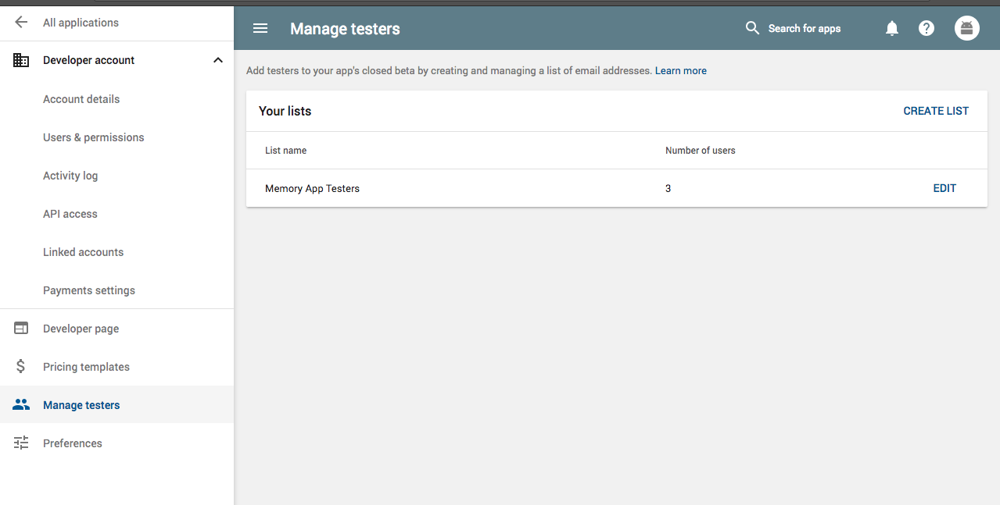
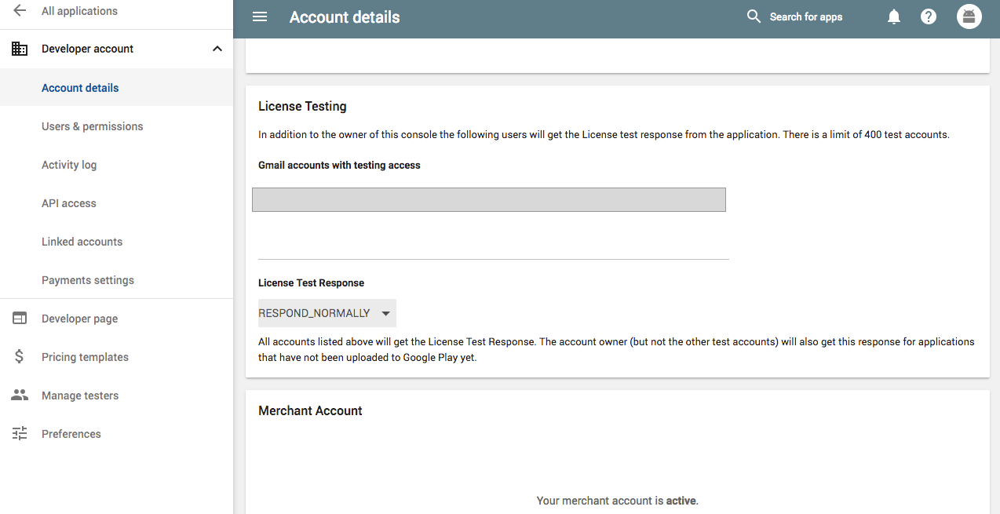
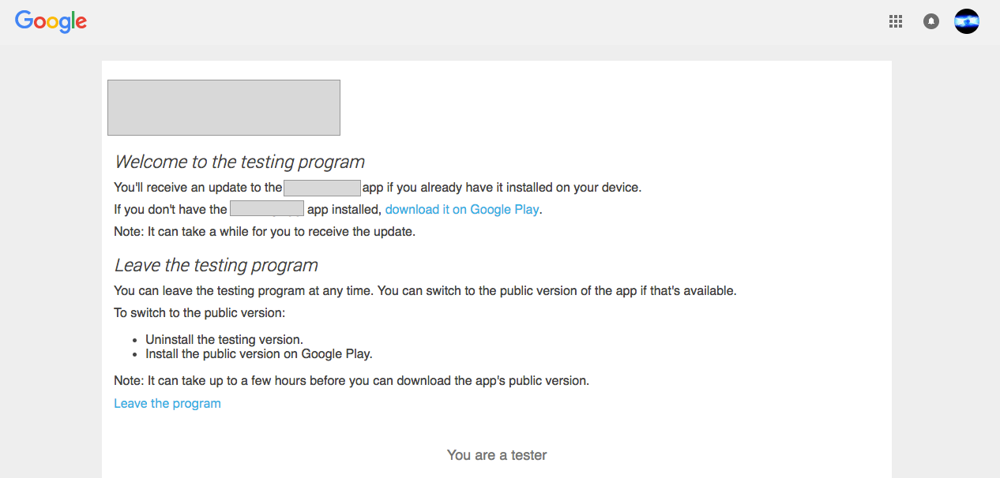

# Implementing In App Purchase in android

### Development
* Use the following AnjLab android in app billing library (https://github.com/anjlab/android-inapp-billing-v3) to implement the in app purchases.

### Testing
* First add in in app purchases in google play developer console
* Once thats done, add the test account in Settings -> Managage Testers.

* Also, add tester email in Settings -> Account Details -> Testing License Section, this is required step to make test account not being charged, see: ttps://stackoverflow.com/questions/29967113/google-just-charged-me-for-my-in-app-test-purchase-what-do-i-do

* Join the testing program for alpha/beta using the link, Google play uses the formated link like  https://play.google.com/apps/testing/com.yourdomain.package

### Resources:
* https://stackoverflow.com/questions/17659204/where-do-alpha-testers-download-google-play-android-apps
* https://stackoverflow.com/questions/29967113/google-just-charged-me-for-my-in-app-test-purchase-what-do-i-do
* https://github.com/anjlab/android-inapp-billing-v3