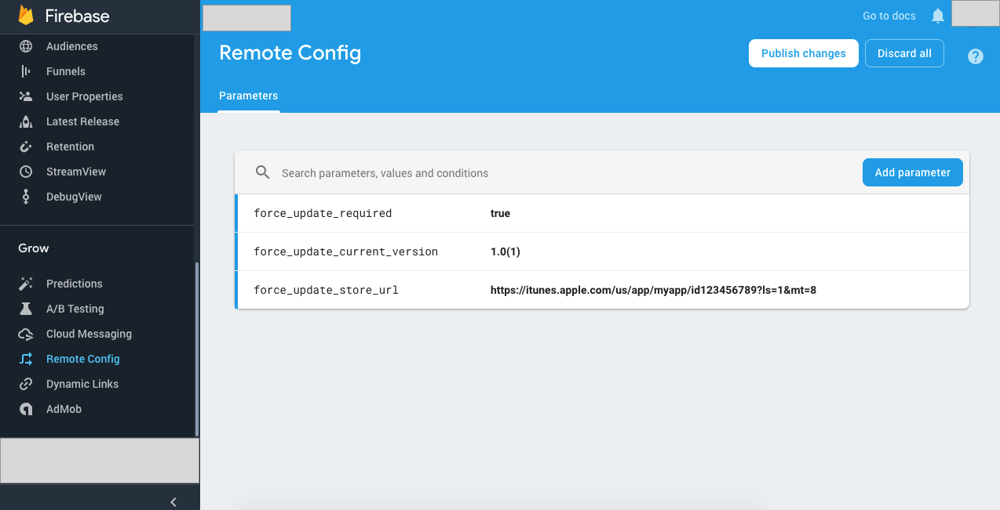

# Implementing Force Update Feature using Firebase Remote Config

### Requirements
* Physical Device will helpful but not necessary

### Introduction
Mobile apps are not like web apps. People download your apps from the app stores and update them if there is a new version. They may use old version of your app anytime. Let’s say old version of your app is not functional anymore. Then, you fix that and upload your new version to store but users have not updated yet. So, they think something is wrong with your app and it sucks. This problem can be solved by a implementing Force Update Feature in your app. By this I mean, when a you upload new version and you want users to use the new version, User will have no way to use the app without updating their app to new one.


### Steps
Lets get our hands dirty with code. First add the so called Firebase Remote Config cocoa pod to podFile.

```
pod 'Firebase/RemoteConfig'
```

Now install the pods, After all this done, add the following helper classes.


* **ForceUpdateChecker.swift**

```swift
//
//  ForceUpdateChecker.swift
//  OutApp
//
//  Created by Sheeraz Ahmed Memon on 23/06/2018.
//  Copyright © 2018 SamSoft. All rights reserved.
//

import Foundation
import Firebase

protocol OnUpdateNeededListener {
    func onUpdateNeeded(updateUrl : String)
    func onNoUpdateNeeded()
}

class ForceUpdateChecker {

    static let TAG = "ForceUpdateChecker"

    static let FORCE_UPDATE_STORE_URL = "force_update_store_url"
    static let FORCE_UPDATE_CURRENT_VERSION = "force_update_current_version"
    static let FORCE_UPDATE_REQUIRED = "force_update_required"
    
    var listener : OnUpdateNeededListener

    init(listener : OnUpdateNeededListener) {
        self.listener = listener
    }

    func check(){
        let remoteConfig = RemoteConfig.remoteConfig()
        let forceRequired = remoteConfig[ForceUpdateChecker.FORCE_UPDATE_REQUIRED].boolValue

        print("\(ForceUpdateChecker.TAG) : forceRequired : \(forceRequired)")
        
        if(forceRequired == true){

            let currentVersion = remoteConfig[ForceUpdateChecker.FORCE_UPDATE_CURRENT_VERSION].stringValue
            print("\(ForceUpdateChecker.TAG) : currentVersion: \(currentVersion!)")

            if(currentVersion != nil){
                let appVersion = getAppVersion()

                if( currentVersion != appVersion){

                    let url = remoteConfig[ForceUpdateChecker.FORCE_UPDATE_STORE_URL].stringValue
                    if(url != nil){
                        listener.onUpdateNeeded(updateUrl: url! )
                    }
                }
                else {
                    listener.onNoUpdateNeeded()
                }
            }
            else {
                listener.onNoUpdateNeeded()
            }
        } else {
            listener.onNoUpdateNeeded()
        }
    }

    func getAppVersion() -> String {
        let versionNumber = Bundle.main.object(forInfoDictionaryKey: "CFBundleShortVersionString") as! String
        let buildNumber = Bundle.main.object(forInfoDictionaryKey: "CFBundleVersion") as! String

        let version = "\(versionNumber)(\(buildNumber))"

        print("\(ForceUpdateChecker.TAG) : version: \(version)")

        return version
        
    }
}


```

* **UpdateAppViewController.swift**

```swift
//
//  UpdateAppViewController.swift
//  OutApp
//
//  Created by Sheeraz Ahmed Memon on 23/06/2018.
//  Copyright © 2018 SamSoft. All rights reserved.
//

import UIKit
class UpdateAppViewController: UIViewController {
    
    var url : String?
    
    @IBAction func onBtnUpdateClick(_ sender: UIButton) {
        openURL(withURL: URL(string: url!)!)
    }
    
    override func viewDidLoad() {
        super.viewDidLoad()
    }
    
    override func viewDidAppear(_ animated: Bool) {
        super.viewDidAppear(animated)
        
        let appDelegate = UIApplication.shared.delegate as! OutAppDelegate
        appDelegate.appVisibleController = self as UpdateAppViewController
        
    }
    
    override func didReceiveMemoryWarning() {
        super.didReceiveMemoryWarning()
        // Dispose of any resources that can be recreated.
    }
}

```

* **UIViewController+UrlOpener.swift**

```swift
//
//  UIViewController+UrlOpener.swift
//  OutApp
//
//  Created by Sheeraz Ahmed Memon on 23/06/2018.
//  Copyright © 2018 SamSoft. All rights reserved.
//

import UIKit
extension UIViewController {
    func openURL(withURL url : URL ){
        if UIApplication.shared.canOpenURL(url) {
            if #available(iOS 10.0, *) {
                UIApplication.shared.open(url, options: [:], completionHandler: nil)
            }
        }
    }
}

```

All set, now you just have to add the force update feature any where in your app. The best plan I have found it AppDelegate class's applicationDidBecomeActive function. so lets do it.

First declare the remote config variable

```swift
var remoteConfig: RemoteConfig!

```

now add the following extensions for AppDelegate

```swift
//Mark:- RemoteConfig Setup
extension MyAppDelegate {
    func setupRemoteConfig(){
        
        remoteConfig = RemoteConfig.remoteConfig()
        remoteConfig.configSettings = RemoteConfigSettings(developerModeEnabled: true)!
        
        //set in app defaults
        let defaults : [String : Any] = [
            ForceUpdateChecker.FORCE_UPDATE_REQUIRED : false,
            ForceUpdateChecker.FORCE_UPDATE_CURRENT_VERSION : "1.0(1)",
            ForceUpdateChecker.FORCE_UPDATE_STORE_URL : "https://itunes.apple.com/us/app/myapp/id12345678?ls=1&mt=8"
        ]
        
        remoteConfig.setDefaults(defaults as? [String : NSObject])
        
        var expirationDuration = 60
        // If your app is using developer mode, expirationDuration is set to 0, so each fetch will
        // retrieve values from the service.
        if remoteConfig.configSettings.isDeveloperModeEnabled {
            expirationDuration = 0
        }
        
        remoteConfig.fetch(withExpirationDuration: TimeInterval(expirationDuration)) { [weak self] (status, error) in
            if status == .success {
                print("config fetch done")
                self?.remoteConfig.activateFetched()
            } else {
                print("Config not fetched")
                print("Error: \(error?.localizedDescription ?? "No error available.")")
            }
        }
    }
}

extension MyAppDelegate : OnUpdateNeededListener {
    func onUpdateNeeded(updateUrl: String) {
        
        let controller = UIStoryboard(name: "Main", bundle: nil).instantiateViewController(withIdentifier: "UpdateAppViewController") as! UpdateAppViewController
        controller.url = updateUrl
        
        if(self.appVisibleController is SplashViewController){
            self.appVisibleController?.present(controller, animated: false, completion: nil)
        } else if ( !( self.appVisibleController is UpdateAppViewController ) ){
            self.appVisibleController?.present(controller, animated: false, completion: nil)
        }
        
    }
    
    func onNoUpdateNeeded() {
        print("onNoUpdateNeeded()")
        if(self.appVisibleController is UpdateAppViewController){
            self.appVisibleController?.dismiss(animated: false, completion: nil)
        }
    }
}
```

Call these functions in applicationDidBecomeActive Function.

```swift
override func applicationDidBecomeActive(_ application: UIApplication) {
        print("AppDelegate : application applicationDidBecomeActive()")
        
        // Restart any tasks that were paused (or not yet started) while the application was inactive. If the application was previously in the background, optionally refresh the user interface.
        super.applicationDidBecomeActive(application)
        
        //setup remote config
        setupRemoteConfig()
        
        ForceUpdateChecker(listener: self).check()
}
```

Next, goto firebase console and add the following parameters
* force_update_store_url
* force_update_current_version
* force_update_required




### Notes
* Do not forget to set developerModeEnabled = true in remote config settings when releasing the app
```swift
remoteConfig.configSettings = RemoteConfigSettings(developerModeEnabled: false)!
```

* If you are wondering whats is the appVisibleViewController, read the following article: 

### Resources
* https://medium.com/@sembozdemir/force-your-users-to-update-your-app-with-using-firebase-33f1e0bcec5a